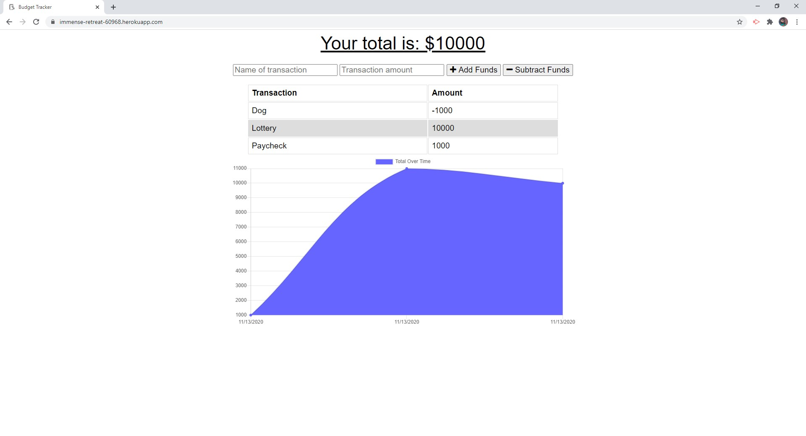

# Budget-Tracker (online / offline)

[Heroku App](https://immense-retreat-60968.herokuapp.com/)

## Table of Contents

- [Description](#description)
- [License](#license)
- [Contributions](#contributions)
- [Test](#test)
- [Technologies](#technologies)
- [Questions](#questions)

## Description:

This app allows users to track their spending history by allowing them to add or subtract their funds. It will track the total based off what the user enters and display their earning and spending history over time using a graph. If a user is online and then goes offline they will still be able to add entries that will be stored offline and then written to the database when they go back online.

## License:

## Contributions:

Right now I am the only one who has contributed, if you would like to then send a pull request and I will review it.

## Test:

No testing.

## Technologies:

This application uses Node.js & Express to route the back-end while the front end uses HTML, CSS, and Javascript. The database is assembled using MongoDB, Mongoose, and IndexedDB during offline use. Finally the app is deployed using Heroku in combination with MongoDB Atlas.

## Questions

For more information you can visit my [Github](https://github.com/grantscriver)
If you have any additional questions you can email me at: Grantscriver@gmail.com